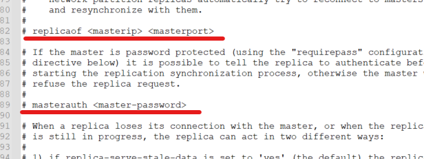
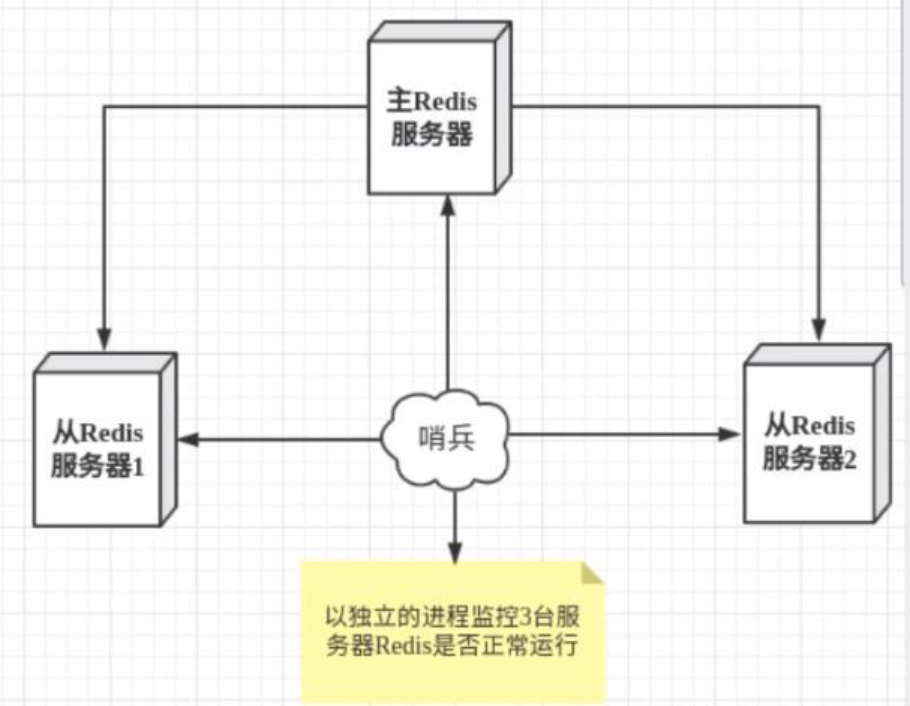
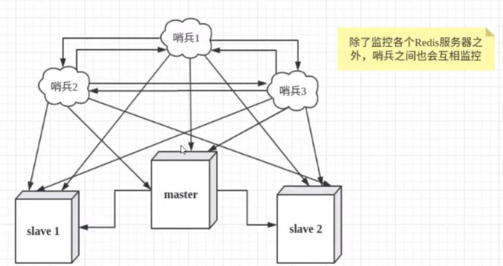

## RDB

> 触发机制

1. 满足配置文件中的save规则；
2. 执行flushall命令；
3. 退出Redis(关闭Redis服务)。

> 如何恢复RDB文件

1. 将RDB文件放置在Redis启动目录，Redis启动的时候就会自动检查dump.rdb恢复数据。

优点：

1. 适合大规模的数据恢复；
2. 对数据完整性要求不高

缺点：

1. 需要一定的时间间隔进行操作，如果Redis意外宕机，最后一次快照之后的数据会丢失；
2. fork进程，需要额外的内存开销。

## AOF

类似于操作日志，恢复数据时回放appendonly.aof。

如果aof文件有错误，Redis将无法启动，Redis提供了`redis-check-aof --fix`修复aof文件。

```yml
appendonly no #默认不开启aof模式，默认使用rdb模式
appendfilename "appendonly.aof" #持久化文件的名字
appendfsync always #每次修改都会sync everysec:每秒执行1次sync，可能会丢失这1秒的数据 no:操作系统自己同步数据
```

缺点：

1. 数据文件：aof远大于rdb，恢复速度也更慢；
2. aof运行效率也比rdb慢。

> 重写规则

```yml
no-appendfsync-on-rewrite no
auto-aof-rewrite-percentage 100
auto-aof-rewrite-min-size 64mb
```

如果aof文件大于64mb了，fork一个新的进程来重写文件。

## RDB-AOF混合

Redis4.0版本之后，aof-use-rdb-preamble: yes开启。

**新的aof文件前半段是rdb格式的全量数据后半段是aof格式的增量数据**

当开启混合持久化时，fork出的子进程先将共享的内存副本全量的以rdb方式写入aof文件，然后在将重写缓冲区的增量命令以aof方式写入到文件，写入完成后通知主进程更新统计信息，并将新的含有rdb格式和aof格式的aof文件替换旧的的aof文件。

当我们开启了混合持久化时，启动redis依然优先加载aof文件，aof文件加载可能有两种情况如下：

1. aof文件开头是rdb的格式, 先加载 rdb内容再加载剩余的 aof；
2. aof文件开头不是rdb的格式，直接以aof格式加载整个文件。

## 发布订阅

subscribe channel 订阅频道

unsubscribe channel 取消订阅频道

publish channel message 将消息发送到指定的频道

> 原理

redis-server里维护一个字典, key是频道, value则是一个链表, 链表中保存了所有订阅了这个channel的客户端。

通过PUBLISH命令向订阅者发送消息, redis-server会使用给定的频道作为键, 在它所维护的channel字典中查找记录了订阅这个频道的所有客户端的链表, 遍历这个链表, 将消息发布给所有订阅者。

## 主从复制

主从复制, 是指将一台Redis服务器的数据, 复制到其他的Redis服务器。前者称为主节点(master/leader) , 后者称为从节点(slave/follower) ; **数据的复制是单向的 ; 只能由主节点到从节点**。Master以写为主, Slave以读为主。

作用:

1. **数据冗余**:主从复制实现了数据的热备份, 是持久化之外的一种数据冗余方式;
2. **故障恢复**:当主节点出现问题时, 可以有从节点提供服务, 实现快速的故障恢复;
3. **负载均衡**:在主从复制的基础上, 配合读写分离, 可以有主节点提供写服务, 由从节点提供读服务, 分担服务器负载;
4. **高可用**


```shell
> info replication #查看当前库信息
# Replication
role:master #角色 master
connected_slaves:0 #从机数量
master_replid:038c1bdb823d591398b8d97c7ed35569ba9656be
master_replid2:0000000000000000000000000000000000000000
master_repl_offset:0
second_repl_offset:-1
repl_backlog_active:0
repl_backlog_size:1048576
repl_backlog_first_byte_offset:0
repl_backlog_histlen:0
```

从机执行命令选择主机

slaveof 127.0.0.1 6379

使用命令配置是暂时的，修改配置文件：

replicaof 配置主机地址即可



> 细节

主机可以写，从机不能写只能读，主机中的所有信息和数据都会自动被从机保存。

没有哨兵的情况下，即使主机宕机，从机连接的主机依然是之前的主机。主机恢复，集群依然可用。如果从机宕机，从机重启后(并且变为从机)，立马就会从主机中取到值。

**复制原理**

slave启动成功连接到master后会发送一个sync同步命令, master接受命令, 启动后台的存盘进程, 同时收集所有接收到的用于修改数据集命令, 在后台进程执行完毕之后, master将传送整个数据文件到slave, 并完成一次完全同步。

- 全量复制 : slave服务在接收到数据库文件数据后, 将其存盘并加载到内存中;
- 增量复制 : master继续将新的所有收集到的修改命令依次传给slave, 完成同步。

重新连接master，一定执行一次全量复制, master继续将新的所有收集到的数据传给slave, 即增量复制。

使自己变为主节点：slave no one

## 哨兵模式

哨兵是一个独立的进程，独立运行。哨兵通过发送命令，等待Redis服务器响应，从而监控运行的多个Redis实例。

作用：

1. 通过发送命令，让Redis服务返回其运行状态，包括主服务器和从服务器；
2. 当哨兵监测到master宕机，会自动从salve选举master，然后通过发布订阅通知其它Redis服务，修改配置文件，让它们切换主机。



多哨兵模式：



假设主服务器宕机，哨兵1先监测到这个结果，系统并不会马上进行故障转移过程，仅仅是哨兵1主观的认为主服务器不可用(主观下线)，当后面的哨兵监测到主服务器不可用，并且数量达到一定值时，那么哨兵之间会进行一次投票，投票的结果由一个哨兵发起，进行故障转移操作。切换成功后，通过发布订阅模式，让各个哨兵把自己监控的从服务器切换主机，这个过程称为客观下线。

> 配置

```yml
#sentinel monitor 被监控的名称 host port 投票
sentinel monitor redis 127.0.0.1 6379 1
```

启动：

```shell
ln -s /usr/local/bin/redis-sentinel /usr/bin/redis-sentinel   #建立软连接,否则找不到命令
redis-sentinel myconfig/sentinel.conf  #启动哨兵
```

如果master节点宕机了，会从slave中选举一个成为master，并把其它slave的主机修改为新的master；如果之前的master恢复了，只能归并到新的master下，当作从机。

**优点：**

1. 基于主从复制，拥有其优点；
2. 主从切换，故障转移，高可用；
3. 健壮性高。

**缺点：**

1. 在线扩容麻烦；
2. 哨兵模式配置比较复杂。

```yml
# Example sentinel.conf

# 哨兵sentinel实例运行的端口 默认26379
port 26379          # 如果有哨兵集群, 我们还需要配置每个哨兵端口

daemonize no

pidfile /var/run/redis-sentinel.pid

logfile ""

# 哨兵的 sentinel的工作目录
dir /tmp            

# 哨兵 sentinel 监控的 redis 主节点 ip port
# master-name 可以自己命名的主节点名字  只能由字母 A-Z  数字0-9 这三个字符".-_" 组成
# quorum 配置多少个 sentinel 哨兵统一认为 master主节点失联, 那么这时候客观上认为主节点失联了
# sentinel monitor <master-name> <ip> <redis-port> <quorum>
sentinel monitor mymaster 127.0.0.1 6379 2

# 当Redia实例中开启了 requirepass foobared 授权密码 这样所有的连接Redis 实例的客户端都要提供密码
# 设置哨兵 sentinel 连接主从密码, 注意必须为主从设置一样的验证密码
# sentinel auth-pass <master-name> <password>
sentinel auth-pass mymaster MySUPER--secret-0123passw0rd

# 指定多少毫秒之后, 主节点没有应答哨兵 sentinel 此时 哨兵主管上认为节点下线 默认 30s
# sentinel down-after-milliseconds <master-name> <milliseconds>
sentinel down-after-milliseconds mymaster 30000

# 这个配置项指定了发生 failover 主备切换时最多有多少个slave同时对新的master 进行同步
# 这个数字越小 完成 failover 所需时间就越长
# 但是如果这个数字越大, 就意味着越多的 slave 因为 replication而不可用
# 可以通过这个值设置为1 来保证每次只有一个 slave 处于不能处理命令的请求状态
# sentinel parallel-syncs <master-name> <numreplicas>
sentinel parallel-syncs mymaster 1

# sentinel failover-timeout <master-name> <milliseconds>
# 故障转移超时时间 failover-timeout 可以用在以下这些方面
# 1 同一个 sentinel 对同一个master两次 failover 之间的间隔时间
# 2 一个 slave 从一个错误的 master 那里同步数据开始计算时间, 直到 slave 被纠正为正确的 master 那里同步数据时
# 3 当想要取消一个正在进行的 failover 所需要的时间
# 4 当进行 failover 时, 配置所有 slaves 指定新的 master 所需要的最大时间. 不过, 即使过了这个超时, slave 依然会被正确的配置为指向 master 但是就不按 paralle1- syncs 所配置规来了
# 默认3分钟
sentinel failover-timeout mymaster 180000

# SCRIPTS EXECUTION
# 配置当某一件事情发生时, 所需要执行的脚本, 可以通过脚本通知来通知管理员, 例如当系统不能正常发邮件通知相关人员
# 对于脚本的运行结果有以下规则
# 若脚本执行后返回1, 那么该脚本稍后将会被再次执行, 重复次数默认为 10
# 若脚本执行后返回2, 或者比2更高的一个返回值, 脚本将不会重复执行
# 如果脚本在执行过程中由于收到系统中断信号被终止了, 则同返回值1时的行为相同
# 一个脚本的最大执行时间为60s, 如果超过了这个时间, 脚本将会被一个SIGKILL信号终止, 之后重新执行 
# sentinel notification-script <master-name> <script-path>
sentinel notification-script mymaster /var/redis/notify.sh

#客户端重新配置脚本
#当一个master由于failover而发生改变时,这个脚本将会被调用,通知相关的客户端关于master地址已经发生改变的信息.
#将以下参数传递给脚本：
#<master name><role><state><from ip><from port><to ip><to port>
#当前<state>始终是“failover”
#<role>是“leader”或“observer”中的一个
#参数 from-ip, from-port, to-ip, to-port是用来和旧的master和新的master(即旧的slave)通信的
#此脚本应该是通用的,能被多次调用, 不是针对性的。
#sentinel client-reconfig-script <master-name> <script-path>
sentinel client-reconfig-script mymaster /var/redis/reconfig.sh

# SECURITY
# 默认情况下，SENTINEL SET将无法在运行时更改通知脚本和客户端重新配置脚本。这避免了一个微不足道的安全问题，客户机可以将脚本设置为任何值，并触发故障转移以执行程序。
sentinel deny-scripts-reconfig yes
```

## 缓存穿透

查询数据，Redis内存数据中不存在(缓存没有命中)，于是向持久层数据库查询，数据库中也不存在。当并发量过大时，频繁请求持久层数据库，数据库压力过大，可能因此宕机导致整个系统不可用。

解决方案：

- 布隆过滤器

  一种数据结构，对所有可能查询的参数以hash形式存储，控制层先进行校验，不符合则丢弃，从而避免了对底层存储系统的查询压力。

- 缓存空对象

  当存储层不命中后，即使返回的空对象也将其缓存起来，同时会设置一个过期时间，之后再访问这个数据将从缓存中缓存中获取，保护了持久层数据库。

  缺点：

  1. 如果空值需要缓存起来，这就意味着缓存需要更多的空间存储更多的键；
  2. 即使对空置设置了过期时间，还是会存在缓存层和存储层的数据会有一段时间不一致。

## 缓存击穿

一个key非常热点，在这个key在失效的瞬间，持续的大并发就会穿破缓存，直接请求数据库，会导致数据库瞬间压力过大。

解决方案：

- 设置热点数据不过期

  会导致缓存永不过期

- 互斥锁

  使用分布式锁，保证每个key同时只有一个线程去查询后端服务，其它线程没有获得分布式锁，只能等待。

## 缓存雪崩

某一个时间段，缓存集中过期失效/Redis宕机。请求集中落在持久层数据库，导致数据库压力过大。

解决方案：

- 缓存过期时间设为随机值
- 使用快速失败的熔断策略，减少数据库瞬间压力
- 使用集群模式和哨兵模式尽量保证缓存服务的高可用

## 分布式锁


## 一致性


## 过期策略
