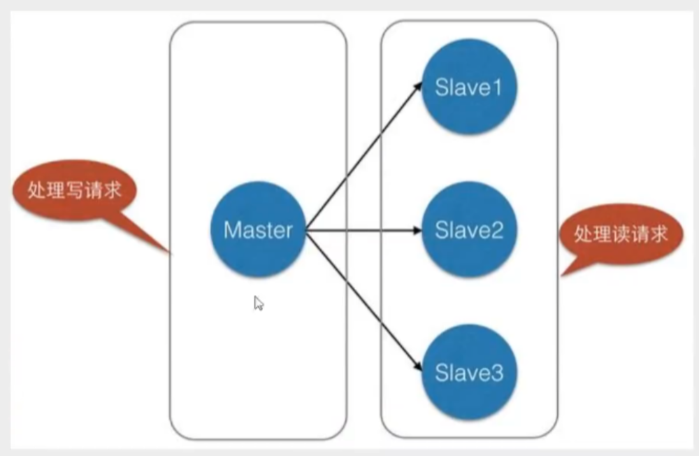
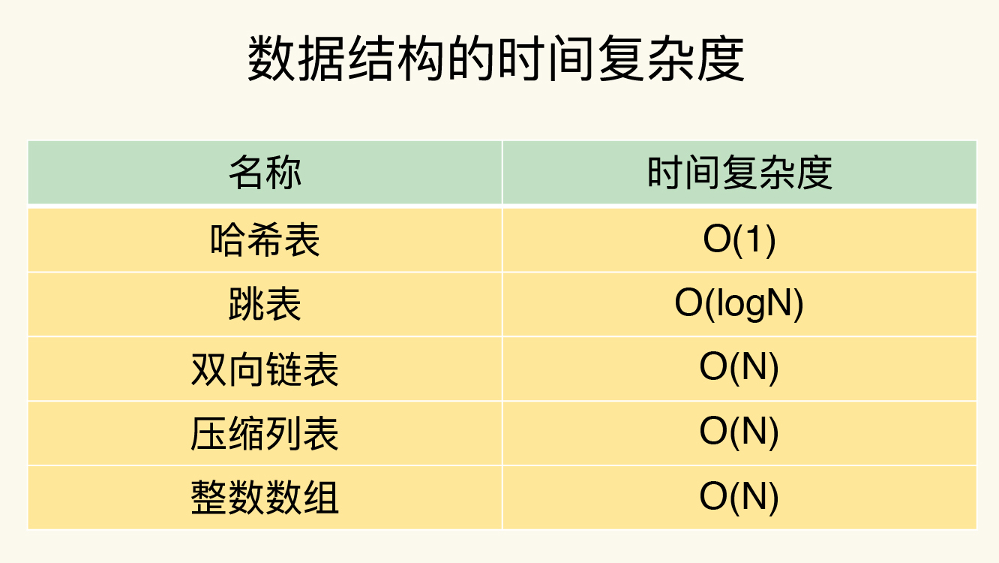

## RDB

> 触发机制

1. 满足配置文件中的save规则；
2. 执行flushall命令；
3. 退出Redis(关闭Redis服务)。

> 如何恢复RDB文件

1. 将RDB文件放置在Redis启动目录，Redis启动的时候就会自动检查dump.rdb恢复数据。

优点：

1. 适合大规模的数据恢复；
2. 对数据完整性要求不高

缺点：

1. 需要一定的时间间隔进行操作，如果Redis意外宕机，最后一次快照之后的数据会丢失；
2. fork进程，需要额外的内存开销。

## AOF

类似于操作日志，恢复数据时回放appendonly.aof。

如果aof文件有错误，Redis将无法启动，Redis提供了`redis-check-aof --fix`修复aof文件。

```yml
appendonly no #默认不开启aof模式，默认使用rdb模式
appendfilename "appendonly.aof" #持久化文件的名字
appendfsync always #每次修改都会sync everysec:每秒执行1次sync，可能会丢失这1秒的数据 no:操作系统自己同步数据
```

缺点：

1. 数据文件：aof远大于rdb，恢复速度也更慢；
2. aof运行效率也比rdb慢。

> 重写规则

```yml
no-appendfsync-on-rewrite no
auto-aof-rewrite-percentage 100
auto-aof-rewrite-min-size 64mb
```

如果aof文件大于64mb了，fork一个新的进程来重写文件。

## RDB-AOF混合

Redis4.0版本之后，aof-use-rdb-preamble: yes开启。

**新的aof文件前半段是rdb格式的全量数据后半段是aof格式的增量数据**

当开启混合持久化时，fork出的子进程先将共享的内存副本全量的以rdb方式写入aof文件，然后在将重写缓冲区的增量命令以aof方式写入到文件，写入完成后通知主进程更新统计信息，并将新的含有rdb格式和aof格式的aof文件替换旧的的aof文件。

当我们开启了混合持久化时，启动redis依然优先加载aof文件，aof文件加载可能有两种情况如下：

1. aof文件开头是rdb的格式, 先加载 rdb内容再加载剩余的 aof；
2. aof文件开头不是rdb的格式，直接以aof格式加载整个文件。

## 发布订阅

subscribe channel 订阅频道

unsubscribe channel 取消订阅频道

publish channel message 将消息发送到指定的频道

> 原理

redis-server里维护一个字典, key是频道, value则是一个链表, 链表中保存了所有订阅了这个channel的客户端。

通过PUBLISH命令向订阅者发送消息, redis-server会使用给定的频道作为键, 在它所维护的channel字典中查找记录了订阅这个频道的所有客户端的链表, 遍历这个链表, 将消息发布给所有订阅者。

## 主从复制

主从复制, 是指将一台Redis服务器的数据, 复制到其他的Redis服务器。前者称为主节点(master/leader) , 后者称为从节点(slave/follower) ; **数据的复制是单向的 ; 只能由主节点到从节点**。Master以写为主, Slave以读为主。

作用:

1. **数据冗余**:主从复制实现了数据的热备份, 是持久化之外的一种数据冗余方式;
2. **故障恢复**:当主节点出现问题时, 可以有从节点提供服务, 实现快速的故障恢复;
3. **负载均衡**:在主从复制的基础上, 配合读写分离, 可以有主节点提供写服务, 由从节点提供读服务, 分担服务器负载;
4. **高可用**



```shell
> info replication #查看当前库信息
# Replication
role:master #角色 master
connected_slaves:0 #从机数量
master_replid:038c1bdb823d591398b8d97c7ed35569ba9656be
master_replid2:0000000000000000000000000000000000000000
master_repl_offset:0
second_repl_offset:-1
repl_backlog_active:0
repl_backlog_size:1048576
repl_backlog_first_byte_offset:0
repl_backlog_histlen:0
```

从机执行命令选择主机

slaveof 127.0.0.1 6379

使用命令配置是暂时的，修改配置文件：

replicaof 配置主机地址即可


> 细节

主机可以写，从机不能写只能读，主机中的所有信息和数据都会自动被从机保存。

没有哨兵的情况下，即使主机宕机，从机连接的主机依然是之前的主机。主机恢复，集群依然可用。如果从机宕机，从机重启后(并且变为从机)，立马就会从主机中取到值。

**复制原理**

slave启动成功连接到master后会发送一个sync同步命令, master接受命令, 启动后台的存盘进程, 同时收集所有接收到的用于修改数据集命令, 在后台进程执行完毕之后, master将传送整个数据文件到slave, 并完成一次完全同步。

- 全量复制 : slave服务在接收到数据库文件数据后, 将其存盘并加载到内存中;
- 增量复制 : master继续将新的所有收集到的修改命令依次传给slave, 完成同步。

重新连接master，一定执行一次全量复制, master继续将新的所有收集到的数据传给slave, 即增量复制。

使自己变为主节点：slave no one

## 哨兵模式

哨兵是一个独立的进程，独立运行。哨兵通过发送命令，等待Redis服务器响应，从而监控运行的多个Redis实例。

作用：

1. 通过发送命令，让Redis服务返回其运行状态，包括主服务器和从服务器；
2. 当哨兵监测到master宕机，会自动从salve选举master，然后通过发布订阅通知其它Redis服务，修改配置文件，让它们切换主机。


多哨兵模式：


假设主服务器宕机，哨兵1先监测到这个结果，系统并不会马上进行故障转移过程，仅仅是哨兵1主观的认为主服务器不可用(主观下线)，当后面的哨兵监测到主服务器不可用，并且数量达到一定值时，那么哨兵之间会进行一次投票，投票的结果由一个哨兵发起，进行故障转移操作。切换成功后，通过发布订阅模式，让各个哨兵把自己监控的从服务器切换主机，这个过程称为客观下线。

> 配置

```yml
#sentinel monitor 被监控的名称 host port 投票
sentinel monitor redis 127.0.0.1 6379 1
```

启动：

```shell
ln -s /usr/local/bin/redis-sentinel /usr/bin/redis-sentinel   #建立软连接,否则找不到命令
redis-sentinel myconfig/sentinel.conf  #启动哨兵
```

如果master节点宕机了，会从slave中选举一个成为master，并把其它slave的主机修改为新的master；如果之前的master恢复了，只能归并到新的master下，当作从机。

**优点：**

1. 基于主从复制，拥有其优点；
2. 主从切换，故障转移，高可用；
3. 健壮性高。

**缺点：**

1. 在线扩容麻烦；
2. 哨兵模式配置比较复杂。

```yml
# Example sentinel.conf

# 哨兵sentinel实例运行的端口 默认26379
port 26379          # 如果有哨兵集群, 我们还需要配置每个哨兵端口

daemonize no

pidfile /var/run/redis-sentinel.pid

logfile ""

# 哨兵的 sentinel的工作目录
dir /tmp            

# 哨兵 sentinel 监控的 redis 主节点 ip port
# master-name 可以自己命名的主节点名字  只能由字母 A-Z  数字0-9 这三个字符".-_" 组成
# quorum 配置多少个 sentinel 哨兵统一认为 master主节点失联, 那么这时候客观上认为主节点失联了
# sentinel monitor <master-name> <ip> <redis-port> <quorum>
sentinel monitor mymaster 127.0.0.1 6379 2

# 当Redia实例中开启了 requirepass foobared 授权密码 这样所有的连接Redis 实例的客户端都要提供密码
# 设置哨兵 sentinel 连接主从密码, 注意必须为主从设置一样的验证密码
# sentinel auth-pass <master-name> <password>
sentinel auth-pass mymaster MySUPER--secret-0123passw0rd

# 指定多少毫秒之后, 主节点没有应答哨兵 sentinel 此时 哨兵主管上认为节点下线 默认 30s
# sentinel down-after-milliseconds <master-name> <milliseconds>
sentinel down-after-milliseconds mymaster 30000

# 这个配置项指定了发生 failover 主备切换时最多有多少个slave同时对新的master 进行同步
# 这个数字越小 完成 failover 所需时间就越长
# 但是如果这个数字越大, 就意味着越多的 slave 因为 replication而不可用
# 可以通过这个值设置为1 来保证每次只有一个 slave 处于不能处理命令的请求状态
# sentinel parallel-syncs <master-name> <numreplicas>
sentinel parallel-syncs mymaster 1

# sentinel failover-timeout <master-name> <milliseconds>
# 故障转移超时时间 failover-timeout 可以用在以下这些方面
# 1 同一个 sentinel 对同一个master两次 failover 之间的间隔时间
# 2 一个 slave 从一个错误的 master 那里同步数据开始计算时间, 直到 slave 被纠正为正确的 master 那里同步数据时
# 3 当想要取消一个正在进行的 failover 所需要的时间
# 4 当进行 failover 时, 配置所有 slaves 指定新的 master 所需要的最大时间. 不过, 即使过了这个超时, slave 依然会被正确的配置为指向 master 但是就不按 paralle1- syncs 所配置规来了
# 默认3分钟
sentinel failover-timeout mymaster 180000

# SCRIPTS EXECUTION
# 配置当某一件事情发生时, 所需要执行的脚本, 可以通过脚本通知来通知管理员, 例如当系统不能正常发邮件通知相关人员
# 对于脚本的运行结果有以下规则
# 若脚本执行后返回1, 那么该脚本稍后将会被再次执行, 重复次数默认为 10
# 若脚本执行后返回2, 或者比2更高的一个返回值, 脚本将不会重复执行
# 如果脚本在执行过程中由于收到系统中断信号被终止了, 则同返回值1时的行为相同
# 一个脚本的最大执行时间为60s, 如果超过了这个时间, 脚本将会被一个SIGKILL信号终止, 之后重新执行 
# sentinel notification-script <master-name> <script-path>
sentinel notification-script mymaster /var/redis/notify.sh

#客户端重新配置脚本
#当一个master由于failover而发生改变时,这个脚本将会被调用,通知相关的客户端关于master地址已经发生改变的信息.
#将以下参数传递给脚本：
#<master name><role><state><from ip><from port><to ip><to port>
#当前<state>始终是“failover”
#<role>是“leader”或“observer”中的一个
#参数 from-ip, from-port, to-ip, to-port是用来和旧的master和新的master(即旧的slave)通信的
#此脚本应该是通用的,能被多次调用, 不是针对性的。
#sentinel client-reconfig-script <master-name> <script-path>
sentinel client-reconfig-script mymaster /var/redis/reconfig.sh

# SECURITY
# 默认情况下，SENTINEL SET将无法在运行时更改通知脚本和客户端重新配置脚本。这避免了一个微不足道的安全问题，客户机可以将脚本设置为任何值，并触发故障转移以执行程序。
sentinel deny-scripts-reconfig yes
```

## 缓存穿透

查询数据，Redis内存数据中不存在(缓存没有命中)，于是向持久层数据库查询，数据库中也不存在。当并发量过大时，频繁请求持久层数据库，数据库压力过大，可能因此宕机导致整个系统不可用。

解决方案：

- 布隆过滤器

  一种数据结构，对所有可能查询的参数以hash形式存储，控制层先进行校验，不符合则丢弃，从而避免了对底层存储系统的查询压力。

- 缓存空对象

  当存储层不命中后，即使返回的空对象也将其缓存起来，同时会设置一个过期时间，之后再访问这个数据将从缓存中缓存中获取，保护了持久层数据库。

  缺点：

  1. 如果空值需要缓存起来，这就意味着缓存需要更多的空间存储更多的键；
  2. 即使对空置设置了过期时间，还是会存在缓存层和存储层的数据会有一段时间不一致。

## 缓存击穿

一个key非常热点，在这个key在失效的瞬间，持续的大并发就会穿破缓存，直接请求数据库，会导致数据库瞬间压力过大。

解决方案：

- 设置热点数据不过期

  会导致缓存永不过期

- 互斥锁

  使用分布式锁，保证每个key同时只有一个线程去查询后端服务，其它线程没有获得分布式锁，只能等待。

## 缓存雪崩

某一个时间段，缓存集中过期失效/Redis宕机。请求集中落在持久层数据库，导致数据库压力过大。

解决方案：

- 缓存过期时间设为随机值
- 使用快速失败的熔断策略，减少数据库瞬间压力
- 使用集群模式和哨兵模式尽量保证缓存服务的高可用

## 分布式锁


## 一致性


## 过期策略


# 数据结构

数据类型：String，List，Hash，Set，Sorted Set

数据结构：简单动态字符串，双向链表，压缩列表，哈希表，跳表，整数数组


**rehash**

1. 给哈希表2分配更大的空间，如哈希表1大小的两倍；
2. 把hash表1的数据重新映射并拷贝到哈希表2中；
3. 释放哈希表1的空间

**渐进式rehash**

第2步拷贝数据时，Redis仍然正常处理请求，每处理一个请求时，从哈希表1中的第一个索引位置开始，顺带将这个索引位置上的所有entries拷贝到哈希表2中，等处理下一个请求时，再顺带拷贝哈希表1中的下一个索引位置的entries。


查找时间复杂度



# Redis单线程为什么这么快？

Redis的网络IO和键值对读写是由一个线程完成的，即Redis对外提供键值存储服务的主要流程。但Redis的其它功能，如持久化、异步删除、集群数据同步等操作，是由额外线程处理的。

1. 大部分操作在内存上完成；
2. 采用了高效的数据结构；
3. 多路复用机制。

**基于多路复用的高性能I/O模型**

在Redis只运行**单线程的情况下，该机制允许内核中，同时存在多个监听套接字和已连接套接字。**一旦有请求到达，就会交给Redis线程处理。为了在请求到达时能够通知到Redis线程，**Redis网络框架调用epoll机制，内核监听这些套接字，select/epoll提供了基于事件的回调，一旦监测到有请求到达，就触发相应的事件，将这些事件放入事件队列，Redis单线程不断处理事件队列。**


# AOF日志

**写后日志**：Redis先执行命令，将数据写入内存，然后才记录日志。

AOF日志记录Redis执行的命令，避免额外的检查开销，只有命令执行成功，才会记录到AOF日志。**避免记录错误命令，不会阻塞当前的写操作。**风险：**数据丢失，阻塞下一个写操作。**

**三种回写策略**

- Always：同步写回，即每个写命令执行完，立马同步的将日志写回磁盘；
- Everysec：每秒写回，每个写命令执行完，只是先把日志写到AOF文件的内存缓冲区，每隔1秒把缓冲区中的内容写入磁盘；
- No：操作系统控制的写回，每个写命令执行完，只是先把日志写到AOF文件的内存缓冲区，由操作系统决定何时将缓冲区中的内容写入磁盘。


**AOF重写机制**

Redis根据数据库现状创建一个新的AOF文件，即读取数据库中所有键值对，然后对每一个键值对用一条命令记录它的写入。重写机制具有"多变一"，可以把日志文件变小。

**AOF重写过程**

"一个拷贝，两处日志"：

1. 主线程fork出后台的bgrewriteaof子进程，此时，fork会把主线程的内存(数据的虚实映射)拷贝一份给bgrewrite子进程，包含数据库的最新数据；

2. 主线程未阻塞，仍可以处理新来的操作。如果来了写操作，Redis把这个操作记录到正在使用的AOF日志缓冲区；

3. 第二处日志，就是指新的 AOF 重写日志。这个操作也会被写到重写日志的缓冲区。

   

# RDB日志

内存快照，内存中的数据在某一时刻的状态记录。相比AOF，RDB记录的是某一时刻的数据，并不是操作。在数据恢复时，可以直接把RDB文件读入内存，很快的完成恢复。

**save**：在主线程中执行，会导致阻塞；

**bgsave**：fork子进程，专门用于写入RDB文件，避免了主线程的阻塞，默认配置。

写时复制(Copy-On-Write，COW)

1. bgsave子进程是由主线程fork生成的，可以共享主线程的所有内存数据。bgsave子进程运行后，开始读取主线程的内存数据，并把它们写入RDB文件；

2. 如果主线程对这些数据都是读操作，那么主线程和bgsave子进程相互不影响；如果主线程要修改一块数据，那么这块数据会被复制一份，生成该数据的副本。然后bgsave子进程会把这个副本数据写入RDB文件，这个过程中，主线程仍然可以修改原来的数据。

   

频繁执行全量快照的开销：全量数据写入磁盘的压力；主线程fork子进程时的开销。

**混合使用AOF和RDB日志**

RDB以一定的频率执行，在两次RDB之间，使用AOF日志记录期间的所有命令操作。


# 主从数据库如何实现数据一致？

Redis提供了主从库模式，以保证数据副本的一致，主从库之间采用读写分离。

读操作：主库、从库都可以接收；

写操作：首先到主库执行，然后，主库将写操作同步给从库。

**主从库间第一次同步**


1. 主从库建立连接、协商同步：从库和主库建立起连接，并告诉主库即将进行同步，主库确认回复后，主从库间就可以开始同步了；
2. 主库将所有数据同步给从库。从库收到数据后，在本地完成数据加载。主库执行 bgsave 命令，生成 RDB 文件，接着将文件发给从库。从库接收到RDB 文件后，会先清空当前数据库，然后加载 RDB 文件
3. 主库会把第二阶段执行过程中新收到的写命令，再发送给从库。当主库完成 RDB 文件发送后，就会把此时 replication buffer 中的修改操作发给从库，从库再重新执行这些操作。

**主从级联模式分担全量复制时的主库压力**

通过"主-从-从"模式将主库生成RDB和传输RDB的压力，以级联的方式分散到从库上。


一旦主从库完成了全量的复制，它们之间就会一直维护一个网络连接，主库会通过这个连接将后续收到的命令操作再同步给从库，这个过程称为**基于长连接的命令传播**，可以避免频繁建立连接的开销。

**主从库间网络断了怎么办？**

2.8之前，全量复制；2.8之后，增量复制，只会把主从库网络断连期间主库收到的命令同步给主库。

主从库断链后，主库会把断连期间收到的写操作命令，写入replication buffer，同时也会把这些操作命令写入repl_backlog_buffer这个缓冲区。

repl_backlog_buffer是一个环形缓冲区，**主库会记录自己写到的位置，从库则会记录自己读到的位置。**

主库偏移量：master_repl_offset

从库偏移量：slave_repl_offset


如果从库的读取速度比较慢，有可能导致从库还未读取的操作被主库新写的操作覆盖了，导致主从库数据不一致。

调整repl_backlog_size，缓冲空间大小 = 主库写入速度命令 * 操作大小 - 主从库间网络传输命令速度 * 操作大小，repl_backlog_zie = 缓冲空间大小 * 2

# 哨兵模式

**基本流程**

哨兵其实就是一个运行在特殊模式下的Redis进程，主从库实例运行的同时，它也在运行，哨兵主要负责的三个任务：**监控、选主和通知**。

- 监控：哨兵进程，周期性的给所有的主从库发送PING命令，检测它们是否正在运行，如果没在规定时间内响应哨兵的PING命令，标记为下线状态，主库下线，还会开始**自动切换主库**的流程。

- 选主：主库挂了之后，哨兵需要按照一定的规则在存活的从库中选择一个实例，作为新的主库。

- 通知：哨兵把新主库的连接信息发给其他从库，让它们执行replicaof命令，和主库建立连接，并进行数据复制。同时，哨兵会把新主库的连接信息通知给客户端，让它们把请求操作发送到新主库上。

  

**主观下线和客观下线**

哨兵进程会使用PING命令检测它自己和主、从库的网络连接情况，用来判断实例的状态。如果检测的是从库，哨兵简单地把它标记为"主观下线"就行了，如果检测的是主库，**集群网络压力较大，网络拥塞，或者是主库本身压力大的情况**下，可能存在误判的情况。

**通常会采用多实例组成的集群模式进行部署，即哨兵集群。**

当有N个哨兵实例时，最好要有N/2 + 1个实例判断主库为"主观下线"，才能最终判定为"客观下线"。


**如何选定新主库？**

筛选+打分

哨兵会按照在线状态、网络状态、筛选过滤掉一部分不符合要求的从库，然后按照从库优先级、从库复制进度、从库ID号大小对剩余的从库打分，只要有得分高的从库出现，就把它选为新的主库。


- 筛选：除了检查从库的当前在线状态，还要判断它之前的网络连接状态。

  配置项：sentinel down-after-milliseconds * 10，如果在down-after-milliseconds 毫秒内，主从节点都没有通过网络联系上，我们就可以认为主从节点断连了，如果发生断连的次数超过了 10 次，就说明这个从库的网络状况不好，不适合作为新主库。

- **打分：**从库优先级、从库复制进度、从库ID号。

  1. 优先级高的从库得分高

     slave-priotity配置项，给从库设置不同的优先级。

  2. 和旧主库同步程度最接近的从库得分高

     slave_repl_offset最最接近master_repl_offset

  3. ID号小的从库得分高


# 哨兵集群

**基于pub/sub机制的哨兵集群组成(发布订阅机制)**

只有订阅了同一个频道的应用，才能通过发布的消息进行信息发布。主从集群中，主库上一个名为"_ _sentinel__:hello"的频道，不同哨兵就是通过它来相互发现、通信的。

哨兵1把自己的IP和端口发布到"_ _sentinel__:hello"频道，哨兵2、3订阅了该频道，那么此时哨兵2、3就可以直接获取哨兵1的IP地址和端口号，哨兵2、3可以和哨兵1建立网络连接了。


哨兵还需对主从库进行心跳判断，还需要通知从库和新主库进行同步。

哨兵向主库发送INFO命令，主库就会把从库列表返回给哨兵。


**基于pub/sub机制的客户端事件通知**

哨兵就是一个运行在特定模式下的Redis实例，只不过它并不服务请求操作，只是完成监控、选主和通知的任务。每个哨兵实例也提供pub/sub机制，客户端可以从哨兵订阅消息。


如订阅"所有实例进入客观下线状态的事件"：

```shell
SUBSCRIBE +odown
```

订阅所有事件：

```shell
PSUBSCRIBE *
```

**由哪个哨兵进行主从切换？**


任何一个实例只要自身判断主库"主观下线"后，就会给其他实例发送is-master-down-by-addr命令，其他实例根据与主库的连接情况，做出Y或N的响应，如果**赞成票数达到了配置文件中的quorum配置项**设定的，就可以标记主库为"客观下线"。

这个哨兵向其他哨兵发送命令，希望由自己执行主从切换，需要满足两个条件：

1. 拿到半数以上的赞成票；
2. 票数大于等于配置文件中的quorum值。

**至少配置3个哨兵实例，要保证所有哨兵实例的配置是一致的，尤其是主观下线的判断值down-after-milliseconds。**

# 切片集群：数据增多了，是该加内存还是加实例？

**切片集群(分片集群)**

启动多个Redis实例组成一个集群，然后按照一定的规则，把收到的数据划分成多分，每一份用一个实例来保存。

**如何保存更多数据？**

- 纵向扩展

  升级单个Redis实例的资源配置，如增加内存容量、磁盘容量、使用更高配置的CPU等。

  优点：

  1. 实施简单

  缺点：

  1. 数据量增加，需要的内存也会增加，主线程fork子进程时可能会阻塞；
  2. 受硬件成本限制

- 横向扩展

  横向增加Redis实例的个数。

  优点：

  1. 硬件成本低

  缺点：

  1. 多实例的分布式管理复制

     数据切片后，在多个实例之间如何分布？

     客户端怎么确定想要访问的数据在哪个实例上？

**数据切片和实例的对应分布关系**

Redis Cluster方案采取哈希槽(Hash Slot)来处理数据和实例之间的映射关系。一个切片集群共有16384个哈希槽，每个键值对都根据它的key，被映射到一个哈希槽中。

1. 根据键值对的key，按照CRC16算法计算一个16bit的值
2. 用这个16bit的值对16384取模，得到一个相应编号的哈希槽

部署Redis Culster方案时，使用cluster create命令创建集群，Redis会自动把这些槽平均分配在集群实例上。如16384/N。

也可以使用cluster meet命令手动简历实例间的连接，形成集群。再使用cluster addslots命令，指定每个实例上的哈希槽个数(更适合Redis实例的内存大小不一)。**在手动分配哈希槽时，需要把 16384 个槽都分配完，否则**
**Redis 集群无法正常工作。**

**客户端如何定位数据？**

1. 客户端和集群实例建立连接后，实例就会把哈希槽的分配信息发给客户端；
2. Redis实例会把自己的哈希槽信息发给和它相连接的其它实例；
3. 客户端收到哈希槽信息后，会把哈希槽信息缓存在本地。当客户端请求键值对时，会先计算键所对应的哈希槽，然后给相应的实例发送请求。

- 变化

  1. 集群中，实例有新增或删除，Redis需要重新分配哈希槽；
  2. 为了负载均衡，Redis需要把哈希槽在所有实例上重新分配一遍。

  客户端缓存的分配信息和最新的分配信息不一致。

  **重定向机制**：客户端给一个实例发送数据读写操作时，这个实例上没有相应的数据，客户端再给一个新实例发送操作命令。

  当客户端把一个键值对的操作请求发给一个实例时，如果这个实例上并没有这个键值对映射的哈希槽，那么实例就返回MOVED命令响应结果，**同时更新本地缓存**

  ```shell
  GET hello:key
  (error) MOVED 13320 172.16.19.5:6379
  #哈希槽13320 在172.16.19.5实例
  ```

  

  如果客户端给实例2发送请求，但Slot2中的数据只部分迁移到实例3。客户端会收到ASK报错信息：

  ```shell
  GET hello:key
  (error) ASK 13320 172.16.19.5:6379
  ```

  客户端需要先给172.16.19.5实例发送一个ASKING命令，让这个实例允许执行客户端接下来执行的命令，然后客户端再向这个实例发送GET命令。

  

  ASK命令并不会更新客户端缓存的哈希槽分配信息。

# 答疑

## 整数数组和压缩列表作为底层数据结构的优势是什么？

"又快又省"

**节省内存空间**：整数数组和压缩列表都是在内存中分配一块地址连续的空间，元素挨个连续放置，非常紧凑，切不用通过额外的指针把元素串接起来，避免额外指针带来的空间开销。

## AOF重写过程中其他潜在的阻塞风险

1. Redis主线程fork创建bgrewriteaof子进程时，内核需要创建用于管理子进程的相关数据结构(进程控制块，PCB)，内核需要把主线程的PCB内容拷贝给子进程，创建和拷贝由内核执行，有阻塞主线程的风险。而且子进程要拷贝父进程的页表，Redis实例内存大，页表就大，fork执行时间会长，会给主线程带来阻塞风险。
1. bgrewriteaof子进程和主线程共享内存。当主线程收到新写或修改操作时，主线程会申请新的内存空间，用来保存新写或修改的数据，如果操作的是bigkey，主线程会因为申请大空间而面临阻塞。

## AOF重写为什么不共享使用AOF本身的日志

都用AOF日志的话，主线程要写，bgrewriteaof子进程也要写，两者会竞争文件系统的锁，影响主线程的性能。

## 4GB内存，2核CPU，写读操作比例：8 : 2，已有数据量大小约2GB，RDB持久的风险

1. 内存不足风险

   写时复制需要给写操作的数据分配新的内存空间，2G * 0.8 = 1.6GB，内存使用量接近饱和，如果有新的key写入或修改，开启Swap：数据写入磁盘，性能下降；未开启Swap：OOM

2. 主进程和子进程竞争使用CPU风险

   生成RDB的子进程需要CPU核运行，主线程本身也需要CPU核运行，如果还有其它后台线程，此时会竞争CPU资源。

## 为什么主从库间复制不使用AOF?

1. RDB二进制文件，写入磁盘、网络传输效率更高；
2. 从库恢复数据的时候，RDB效率更高。

## 在主从切换过程中，客户端能否正常地进行请求操作？

主从集群一般采用读写分离的方式，主库故障之后，客户端仍然可以把读请求发送给从库，但对于写请求操作，客户端就无法执行了。

## 如果想要应用程序不感知服务的中断，还需要哨兵或客户端再做些什么？

1. 客户端可以缓存写请求；
2. 主从切换完成后，客户端和新主库建立连接，哨兵需要提供订阅频道，让客户端可以订阅到新主库。同时，客户端也需要可以主动和哨兵通信，询问新主库的信息。

## 5 个哨兵实例的集群，quorum 值设为 2。在运行过程中，如果有 3 个哨兵实例都发生故障了，此时，Redis 主库如果有故障，还能正确地判断主库“客观下线”吗？如果可以的话，还能进行主从库自动切换吗？

认为主库“主观下线”的哨兵个数要**大于等于quorum 值**，可以正常判断主库"客观下线"；**主从切换，需要获得半数以上哨兵投票**，无法进行主从切换。

## 哨兵实例是不是越多越好呢？如果同时调大 down-after-milliseconds 值，对减少误判是不是也有好处？

哨兵实例越多，误判率越低。但主从切换的时间也会变久，客户端堆积较多请求，可能会导致客户端请求溢出，从而导致请求丢失。

调大down-after-milliseconds，导致主库实际已经发生故障，但哨兵过了很久才判断出来，影响Redis对业务的可用性。

## 为什么 Redis 不直接用一个表，把键值对和实例的对应关系记录下来？

如果键值对和实例的对应关系发生了变化(如实例增减、数据重新分布)，就要修改表。单线程：所有操作串行，性能慢；多线程：涉及到加锁。

基于哈希槽计算，虽然也要记录哈希槽和实例的对应关系，但哈希槽的个数要比键值对的个数少很多。

## replication buffer 和 repl_backlog_buffer 的区别

replication buffer：主从库在进行全量复制时，主库上用于和从库连接的客户端buffer；

repl_backlog_buffer：支持从库增量复制，主库上用于持续保存写操作的一块专用buffer。

# String

- int编码方式

  64位有符号整位

  保存为一个8字节的Long类型整数

- embstr编码方式

  数据中包含字符，且字符串小于等于44字节时

  简单动态字符串(SSD)

  

  buf：字节数组，保存实际数据。Redis会自动在数组最后增加"\0"表示结束，额外占用1个字节；

  len：占4个字节，表示buf的已用长度；

  alloc：占4个字节，表示buf实际长度，一般大于len。

  RedisObject

  元数据：最后一次访问的时间、被引用的次数等。

  

  当保存的是Long类型整数时，RedisObject中的指针直接赋值为整数数据，节省了指针的空间开销。

  embstr编码：当保存的是字符串数据，并且字符串小于等于44字节时，RedisObject中的数据、指针和SDS是一块连续的内存区域，避免内存碎片。

- raw编码方式

  数据中包含字符，且字符长度大于44

  SDS分配独立空间，并用指针指向SDS。

  

Redis会使用一个全局哈希表保存所有键值对，哈希表的每一项都是一个dictEntry的结构体，用来指向一个键值对。dictEntry的结构有三个8字节的指针，分别指向key、value及下一个dictEntry，共24字节。Redis使用的内存分配库jemalloc，比N大，最接近2的幂次数，减少频繁分配的次数，即32字节。


 Key：10 位数的图片 ID Value：10 位数的图片存储对象 ID

(RedisObject元数据8字节 + 直接赋值整数数据8字节) * 2 + dictEntry32字节 = 64字节

# 压缩列表(ZipList)


表头：

- zlbytes：列表长度
- zltail：列表尾的偏移量
- zllen：列表中entry个数

表尾

- zlend：列表结束

Entry：

- prev_len：前一个entry的长度，1字节：上一个entry的长度小于254字节(255被zlend使用)，5字节：
- len：自身长度，4字节；
- encoding：编码方式，1字节；
- content：保存实际数据。

entry连续放置内存中，不需要额外的指针进行连接。

每个entry保存一个图片存储对象ID(content 8字节) + pre_len(1字节) + 编码方式(1字节) + 自身长度len(4字节) =>16字节

Redis基于压缩列表实现了List、Hash、SortedSet，节省了dictEntry的开销。采用集合类型时，一个 key 就对应一个集合的数据，能保存的数据多了很多，但也只用了一个 dictEntry，这样就节省了内存。

